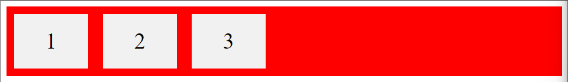

# Poc FlexBox
## O projeto a seguir tem por objetivo percorrer propriedades do FlexBox, mostrar seu funcionamento e seu código.

Conteudos deste projeto
------------------------
<!--ts-->
* [Flex Container](#Flex-Container)  
    * [Flex-Direction](#Flex-Direction)  
    * [Flex-Wrap](#Flex-Wrap)   
    * [Flex-Flow](#Flex-Flow)  
    * [Justify-Content](#Justify-Content) 
    * [Align-Items](#Align-Items)  
    * [Align-Content](#Align-Content)  
    * [Centralizar perfeitamente](#Centralizar-perfeitamente)  
* [Flex Items](#Flex-Items)  
    * [Child Elements](#Child-Elements) 
    * [Order Property](#Order-Property) 
    * [Flex-Grow](#Flex-Grow) 
    * [Flex-Shrink](#Flex-Shrink) 
    * [Flex-Basis](#Flex-Basis) 
    * [Flex-Property](#Flex-Property) 
    * [Align-Self](#Align-Self) 
* [Flex Responsive](#Flex-Responsive) 
    * [Responsive-Flexbox](#Responsive-Flexbox) 
    * [Responsive-Image](#Responsive-Image) 
    * [Responsive-Website](#Responsive-Website)
  <!--te-->

## Flex Container

Para a demonstração visual das propriedades do Flex Container utilizaremos o seguinte layout HTML/CSS

### Flex-Direction
Define a direção em que o container vai organizar os itens

### Column
Organiza verticalmete

### Column-Reverse
Organiza verticalmente (mas do final até o começo)

### Row
Organiza horizontalmente

### Row-Reverse
Organiza horizontalmente (mas do ultimo até o primeiro)

## Flex-Wrap
Define se os itens devem ser encapsulados ou não

Aqui utilizaremos um outro modelo HTML para melhor exemplificação.

### Flex-Wrap
Encapsula os itens

### No Wrap
Não encapsula os itens 

### Wrap reverse
Encapsula os intens na ordem reversa

## Flex-Flow
Esta propriedade é uma junção das propriedades Wrap e Row, por conta disso todas as propriedades anteriores podem ser aplicadas do seguinte modo

### Exemplo 1
Aqui utilizamos row e wrap para organizar os itens

### Exemplo 2
Aqui trocamos o row pelo row reverse para organizar os itens

## Justify-Content
Utilizada para alinhar itens

### Center
Alinha no centro

### Flex Start
Alinha ao começo do container

### Flex End
Alinha ao final do container

### Space Around
Alinha com um espaço maximo entre os itens.

### Space Between
Alinha com o espaço maximo entre os itens

### Space Evenly
Alinah com o mesmo espaço antes, entre e depois dos itens

## Align-Items
Alinha os itens em relação ao espaço em relação ao container

### Center
Alinha ao centro

### Flex Start
Alinha na parte superior do container

### Flex End
Alinha na parte inferior do container

### Stretch
Alinha sobre o espaço do container

### Baseline
Alinha os itens a faixa central do container com a faixa central da div filha

Aqui modificamos os tamanhos das Div Filhas e o tamanho de fonte usado em cada uma para melhor demonstração

## Align-Content
Alinha o conteudo inteiro em relação ao espaço do container

Aqui modificamos o tamanho do container e a quantidade de divs filahs para a melhor demonstração

### Space Between
Alinha com um espaço entre as linhas

### Space Around
Alinha com um espaço antes, entre e depois das linhas

### Stretch
Alinha as linhas fazendo-as ocupar o espaço restante do container

### Center
Alinha as linhas no centro do container

### Flex Start
Alinha no inicio do container

### Flex End
Alinha no final do container

## Centralizar perfeitamente
Podemos centralizar algo perfeitamente utilizando o Justify-Content:Center e o Align-Items:Center, como mostra o exemplo a seguir

## Child Elements
Os elementos filhos diretos de um contêiner flexível se tornam automaticamente itens flexíveis (flex). As propriedades do Flex Item são: Order, Flex-grow, Flex-shrink, Flex-basis, Flex e Align-self.

O elemento acima representa quatro itens flexíveis verdes claro dentro de um contêiner flexível verde.

### The Order Property
A propriedade Order especifica a ordem dos itens flexíveis.

O primeiro item flexível no código não precisa aparecer como o primeiro item no layout.
O valor do pedido deve ser um número, o valor padrão é 0.

Exemplo:

### Flex-Grow
A propriedade  flex-grow especifica o quanto um item flexível crescerá em relação ao restante dos itens flexíveis.

O valor deve ser um número, o valor padrão é 0.

### Flex-Shrink
A propriedade flex-shrink especifica o quanto um item flexível encolherá em relação ao restante dos itens flexíveis.
O valor deve ser um número, o valor padrão é 1.

### Flex Basis
A propriedade flex-basis especifica o comprimento inicial de um item flexível.

### Flex Property
A flex property é uma abreviação para as propriedades flex-grow, flex-shrinke flex-basis.

### Align-Self
A propriedade align-self especifica o alinhamento do item selecionado dentro do contêiner flexível.

A propriedade substitui o alinhamento padrão definido pela propriedade align-self do contêiner .align-items

Nestes exemplos usamos um contêiner de 200 pixels de altura, para demonstrar melhor a propriedade align-self:

## Responsive Flexbox
É possível usar media queries para criar layouts diferentes para diferentes tamanhos de tela e dispositivos.

Por exemplo, se você quiser criar um layout de duas colunas para a maioria dos tamanhos de tela e um layout de uma coluna para telas pequenas (como celulares e tablets), você pode alterar o flex-direction de row para column em um ponto de interrupção específico (800px no exemplo abaixo):

<img src="./images/
